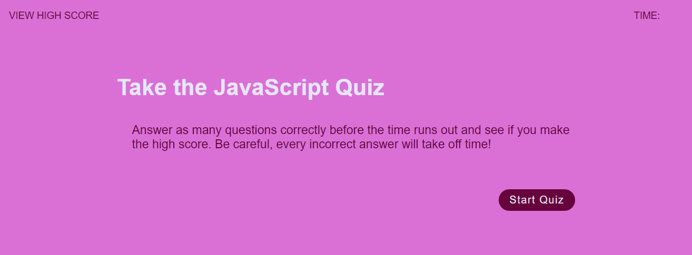

# JavaScript Timed Quiz

---

## Description
JavaScript Timed Quiz https://christinelea.github.io/JavaScript-Timed-Quiz/
This interactive quiz incorporates JavaScript and Web API functionality.
Planning the application started with drawing out a plan to visually see what was required, followed by writing pseudo-code allowed me to acheive this completed application.

---

### Features
- Objects are used to store Question and Answers as well as a reference to each questions correct answer.
- Each section of the application uses a function and CSS Display property to toggle on and off the order in which they are displayed.
- setInteral() and clearInterval() methods are used to create two timers, one for the quiz and one to add a half a second delay between questions and displaying the users result.
- DOM manipulation is achieved through query selectors, and using textContent property to update outputs to the user.
- Event listeners fire off each section of the application in response to user input.
- Local storage is used to store and display the user's score.

## Installation
NA

## Usage
This application is just for fun! Feel free to have a look at my code to see how it works.
My deployed application's appearance: 

## Roadmap
Update so that multiple highscores can be added.

## Contributing
Not currently seeking contribution.

## Authors and acknowledgment
I would like to acknowledge Tyler from AskBCS. I had created a timing function that was not working as expected and he helped me to understand how a simplified version of the function could offer a better solution. 

## License
MIT License

